# How to Deploy a Node Project to AWS using Pipeline, Github, and Elastic Beanstalk

## Step 1: Write a Node App

Make sure it runs locally, and deploy it to Github. 

## Step 2: Create an Elastic Beanstalk App

It's okay to initialize with sample code for now. We will be overwriting it with the Pipeline later. 

## Step 3: Create a Pipeline

Go to the AWS console and click the "Create Pipeline" button.  

#### Important fields to fill out:

##### Pipeline name:

Pick something that makes sense. You will be living with it.

##### Service Role:

This will determine the permissions and access for your Pipeline. 

Pick a role that makes sense for your project. 

For our purposes, we created a new role which automatically grants default privileges.

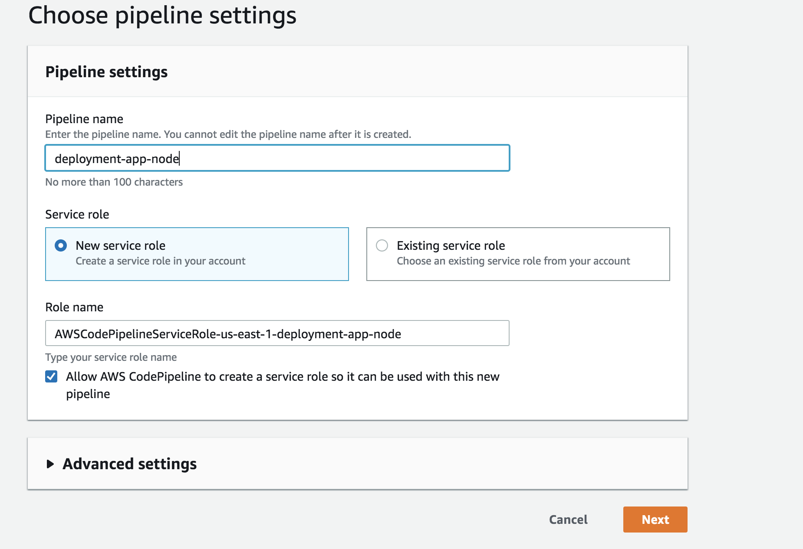 

#### Source 

Your Github repo. 

You can log in with your Github credentials and select your repo. You can also customize which branch you want 
Pipeline to deploy. 

We recommend using your master branch.

##### Code Detection Options

Go with Github webhooks. 

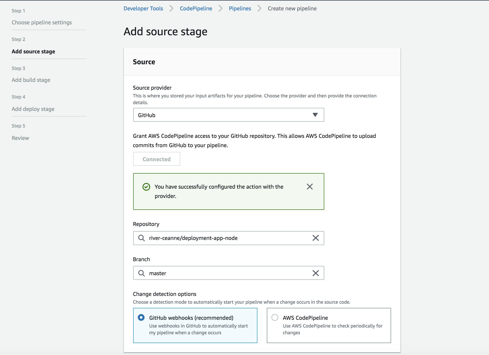

#### Build

Create build using AWS Code Build

Config section
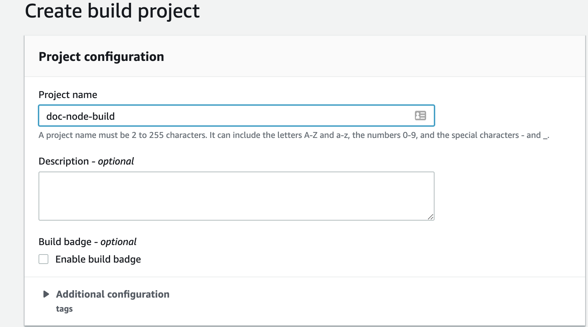

Source section
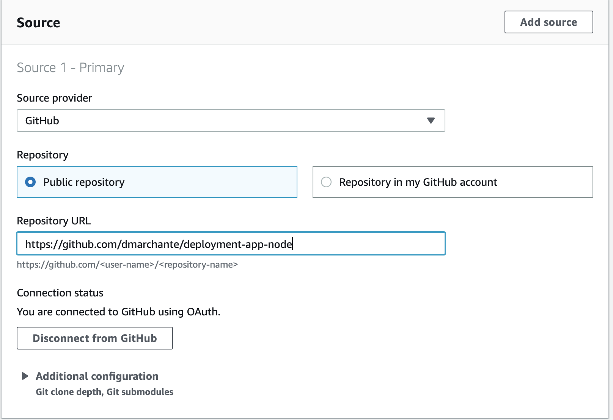

Environment section
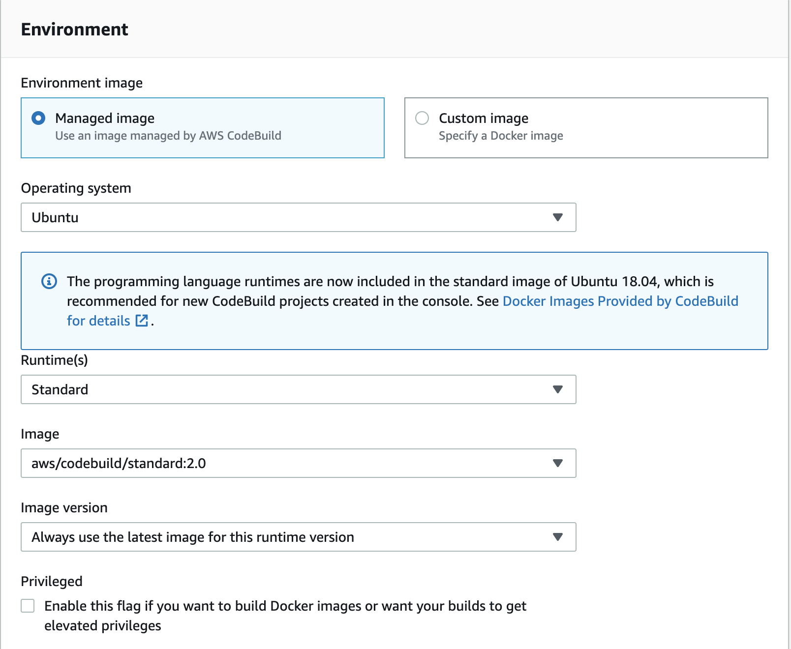
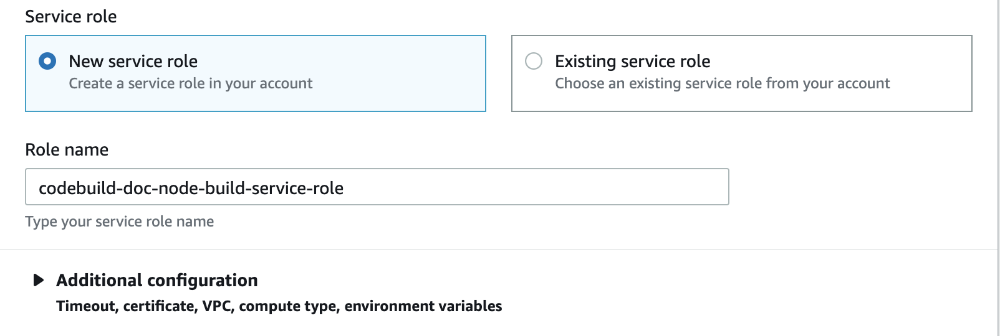

Specification section

Artifacts section

Logs section

Create

Add Build Stage to Pipeline

Add Stage

Name Your Stage
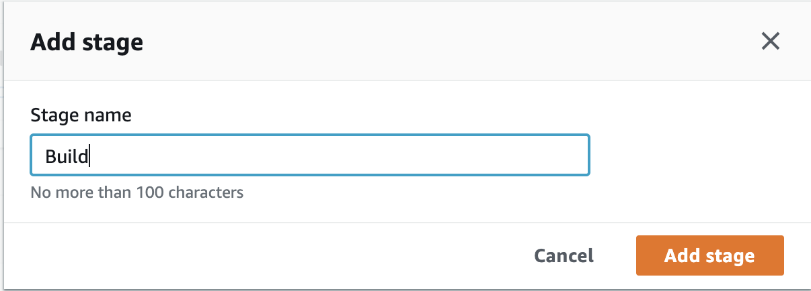

Add Action Group
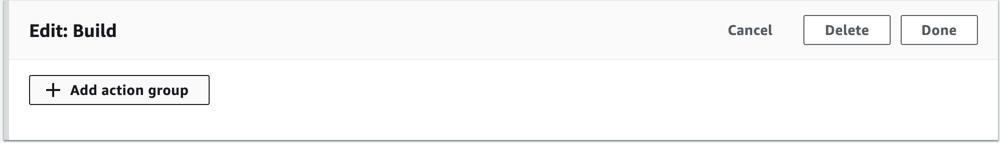

Name Your Action
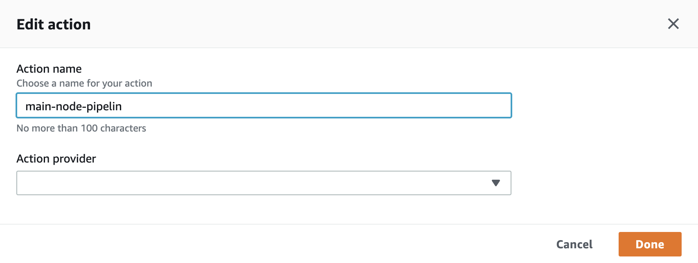

Enter Action Parameters
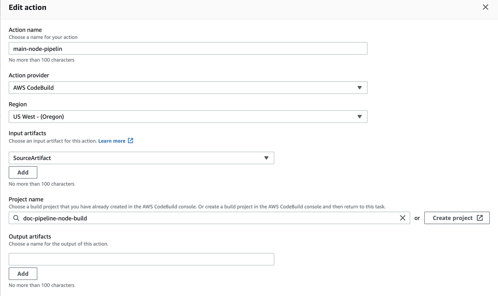

Click Done
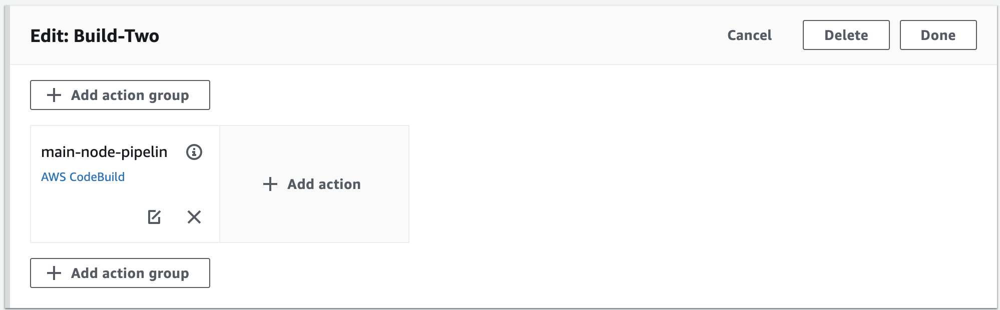

Your Done
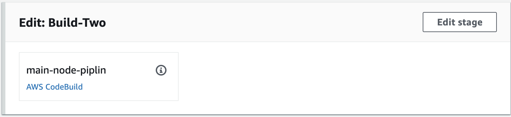

#### Provider

We are going to choose Elastic Beanstalk and the EB app we made in step 2.

 

## Step 4: Create Pipeline

Click the **Create Pipeline** button. You're done!

Need proof? Here's [a link](http://mainnodepipeline-env.ptrkp2rcp6.us-west-2.elasticbeanstalk.com/) to our deployed "app."

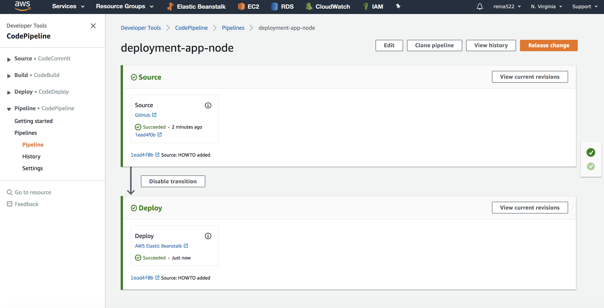

Added Build Section
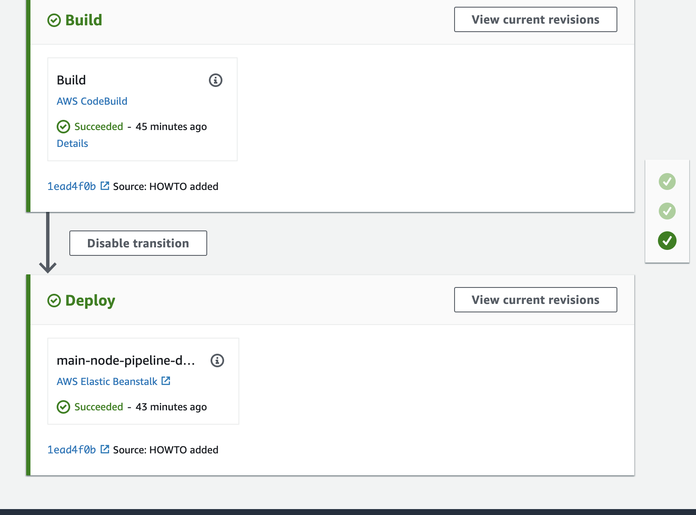
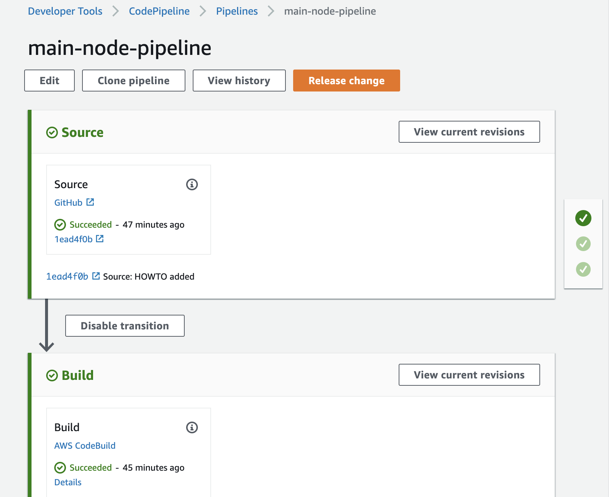

## Troubleshooting

For most issues, you can find out where it went wrong by checking the checkmarks on the right. If the error is on the
 source, the first checkmark will be red. If it's on the deployment, the second checkmark will be red. 
 
 In those situations, you can either click the "Details" link in that pane for more info on the error, or you can go 
 to the original logs at the respective service. 
 
 ## Team
 Jhia Turner
 Roger Huba
 David Marchante
 Kent Ketter

 

